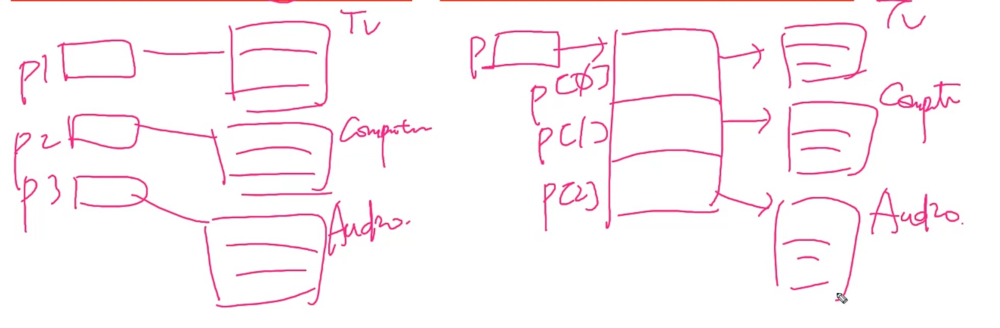
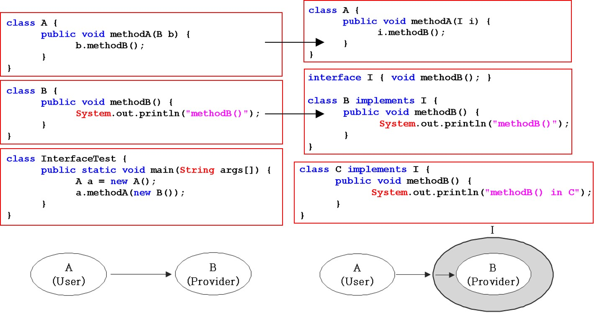

# Ch07. 객체지향 프로그래밍 II
-----------------

# 1. 상속(inheritance)

### 1.1 상속의 정의와 장점 // 그림 도 그릴 수 있어야함

* 기존의 클래스로 새로운 클래스를 작성(코드의 재사용)
* 두 클래스를 부모와 자식으로 관계를 맺어주는 것
* 자손은 조상의 모든 멤버를 상속 받는다.(생성자, 초기화 블럭 제외)
* 자손의 멤버 개수는 조상보다 적을 수 없다.(같거나 많다)
* 자손의 변경은 조상에 영향을 미치지 않는다.

```java
class Parent {                  //부모클래스 : 멤버 1개
    int age;
}                               //상속 관계

class Child extends Parent {    //자식클래스 : 멤버 2개
    void play() {               //자신의 멤버 1 개
        System.out.println("Let's play~!")
    }                           //상속받은 멤버 1개 (int age;)
}
```

### 1.2 클래스간의 관계 - 포함관계

* 클래스의 멤버로 참조변수를 선언하는 것
* 작은 단위의 클래스를 만들고, 이 들을 조합해서 클래스를 만든다.
* 저장 공간은 같으나 구조적 차이 발생 // * 그림 추가하기

### 1.3 클래스 간의 관계 결정하기

* 대부분 포함으로 진행
* 상속관계 : '~은 ~이다.(is - a)'
    - 원은 점이다.
* 포함관계 : '~은 ~을 가지고 있다.(has -a)'
    - 원은 점을 가지고 있다. 더 자연스러움.

### 1.4 단일 상속(Single Inheritance)

* Java는 단일상속만을 허용 : 하나의 부모만 상속
* 비중이 높은 클래스 하나만 상속관계로, 나머지는 포함관계로 한다.

### 1.5 Object클래스 - 모든 클래스의 조상

* 부모가 없는 클래스는 자동적으로 Object클래스를 상속받게 된다.
* 모든 클래스는 Object클래스에 정의된 11개의 메서드를 상속받는다.
    - toString(), equals(Object obj), hashCode(), ...등
      

----------------

## 2. 오버라이딩(overriding)

### 2.1 오버라이딩이란?

* 상속받은 조상의 메서드를 자신에 맞게 변경하는 것 (overide : 덮어쓰다)

```java
class Point {
    int x;
    int y;

    String getLocation() {
        return "x:" + x + ", y:" + y;
    }
}

class Point3D extends Point {
    int z;

    String getLocation() {
        return "x:" + x + ", y:" + y + ", z:" + z;
    }
}

public class OverrideTest {
    public static void main(String[] args) {
        Point3D p = new Point3D();
        p.x = 3;
        p.y = 5;
        p.z = 7;
        System.out.println(p.getLocation());    // x:3, y:5, z:7 출력
    }
}
```

```java
//class Point extends Object { // 명시적으로 extends 하다는 알람이 뜸
class Point {
    int x;
    int y;

    /*
    생성자를 통해 더 간결하고 직관적인 코드 작성이 가능
    Point(int x, int y) {
        this.x = x;
        this.y = y;
  }    
*/

    // Object 클래스의 toString()을 오버라이딩
    public String toString() {
        return "x:" + x + ", y:" + y;
    }
}

public class OverrideTest {
    public static void main(String[] args) {
/*
        생성자 통해 작성했을 때
        Point p = new Point(3,5);
        System.out.println(p);  
*/

        Point p = new Point();
        p.x = 3;
        p.y = 5;
//      System.out.println(p.toString()); // x:3, y:5 출력 toString이 불필요함
        System.out.println(p);            // x:3, y:5 출력 
    }
}
```

### 2.2 오버라이딩의 조건

* 선언부가 조상 클래스의 메서드와 일치해야 한다
    - 선언부(반환타입, 메서드이름, 매개변수목록)
* 접근 제어자를 조상 클래스의 메서드보다 좁은 범위로 변경할 수 없다
    - public, protected, private
* 예외는 조상 클래스의 메서드보다 많이 선언할 수 없다

### 2.3 오버로딩 vs. 오버라이딩

* 오버로딩(overloading) : 기존에 없는 새로운 메서드를 정의하는 것(new)
    - 같은 이름의 메서드, 상속과 연관이 없음
* 오버라이딩(overriding) : 상속받은 메서드의 내용을 변경하는 것(change, modify)

```java
class Parent {
    void parentMethod() {
    }
}

class Child extends Parent {
    void parentMethod() {           //조상의 메서드를 자손클래스에서 변경
    }                               //오버라이딩

    void parentMethod(int i) {      //이름이 같은 메서드를 매개변수만 다르게 정의
    }                               //오버로딩

    void childMethod() {            //메서드 정의
    }

    void childMethod(int i) {       //이름이 같은 메서드를 매개변수만 다르게 정의
    }                               //오버로딩

    void childMethod() {            //중복정의
    }                               //에러
}

```

### 2.4 참조변수 super

* 객체 자신을 가리키는 참조변수(this와 유사함)
    - this: lv와 iv 구별에 사용
* 인스턴스 메서드(생성자)내에만 존재(static메서드 내에서 사용 불가)
* 조상의 멤버를 자신의 멤버와 구별할 때 사용

```java
class Ex_super {
    public static void main(String[] args) {
        Child c = new Child();
        c.method();
        System.out.println("c.x = " + c.x);           // c.x = 20
    }
}

class Parent {
    int x = 10;
}

class Child extends Parent {
    int x = 20;                                       //없을 경우 모두 부모의 x(10)

    void method() {                                   // x가 두개여도 서로 다름
        System.out.println("x = " + x);               // x = 20
        System.out.println("this.x = " + this.x);     // this.x = 20
        System.out.println("super.x = " + super.x);   // super.x = 10
    }
}
```

### 2.5 super() 조상의 생성자

* 조상의 생성자를 호출할 때 사용
* 조상의 멤버는 조상의 생성자를 호출해서 초기화
* 생성자의 첫줄에 반드시 생성자를 호출해야한다.☆
* 그렇지 않으면 컴파일러가 생성자의 첫 줄에 super(); 를 삽입

```java
class Ex_super2 {
    public static void main(String[] args) {
        Point3D p3 = new Point3D(4, 5, 3);
        System.out.println("x = " + p3.x + ", y = " + p3.y + ", z = " + p3.z);
    }
}

class Point1 {
    int x, y;

    Point1(int x, int y) {
        this.x = x;
        this.y = y;
    }
}

class Point3D extends Point1 {
    int z;

    Point3D(int x, int y, int z) {
        super(x, y);   // Point(int x, int y)를 호출, 조상의 멤버는 조상의 생성자가 초기화 
        this.z = z;
    }
}
```

------------

## 3. package와 import

### 3.1 패키지(package)

* 서로 관련된 클래스의 묶음
* 클래스는 클래스 파일'*.class', 패키지는 폴더. 하위 패키지는 하위 폴더
* 클래스의 실제 이름(full name)은 패키지를 포함. 'java.lang.String'
* 'rt.jar'(runtime)는 클래스들을 압축한 파일(java9 부터 모듈개념 생기면서 없어짐)

### 3.2 패키지의 선언

* 패키지는 소스파일의 첫 번째 문장으로 단 한번 선언
* 같은 소스 파일의 클래스들은 모두 같은 패키지에 속하게 된다.
* 패키지 선언이 없으면 이름 없는(unnamed) 패키지에 속하게 된다.

### 3.3 클래스 패스(classpath)

* 클래스 파일'*.class'의 위치를 알려주는 경로(path)
* 환경변수 classpath로 관리하며, 경로 간의 구분자는 ';'를 사용
* classpath(환경변수)에 패키지의 루트를 등록해줘야 함

### 3.4 import 문

* 클래스를 사용할 때 패키지 이름을 생략할 수 있다.
* java.lang 패키지의 클래스는 import하지 않고도 사용할 수 있다.
    - String, Object, System, Thread, ...
    - 원래 패키지 'java.lang.*';
* import 문 선언 방법
    - import 패키지명.클래스명;
    - import 패키지명.\*; <- '\*' 은 패키지 내 모든 클래스를 의미(패키지 포함 X)
    - import 문은 패키지문과 클래스 선언 사이에 선언한다.
    - import 문은 컴파일 시에 처리되므로 프로그램 성능에 영향 없음
    - 이름이 같은 클래스가 속한 두 패키지를 import 할 때는 클래스 앞에 패키지명 붙여줘야 한다.
* static import문
    - static멤버를 사용할 때 클래스 이름을 생략할 수 있게 해준다.

---------------

## 4. 제어자(modifier)

### 4.1 제어자란?

* 클래스와 클래스의 멤버(멤버 변수, 메서드)에 부가적인 의미 부여
    - 접근 제어자 : public, protected, (default), private
    - 그 외 : static, final, abstract, native, transient, synchronized, volatile, strictfp
* 하나의 대상에 여러 제어자를 같이 사용가능(접근 제어자는 하나만)

### 4.2 static : 클래스의, 공통적인

### 4.3 final : 마지막의, 변경될 수 없는

### 4.4 abstract: 추상의 미완성의

### 4.5 접근 제어자(access modifier)

* 접근제어자가 사용될 수 있는 곳 - 클래스, 멤버변수, 메서드, 생성자
    - private : 같은 클래스 내에서만 접근이 가능하다.
    - (default) : 같은 패키지 내에서만 접근이 가능하다.
    - protected : 같은 패키지 내에서, 그리고 다른 패키지의 자손클래스에서 접근이 가능하다.
    - public : 접근 제한이 전혀 없다.

### 4.6 캡슐화와 접근제어자

* 접근 제어자를 사용하는 이유
    - 외부로부터 데이터를 보호하기 위해
    - 외부에는 불필요한(내부적으로만 사용되는) 부분을 감추기 위해

--------

## 5. 다형성(polymorphism)

### 5.1 다형성이란?

* 여러가지 형태를 가질 수 있는 능력
* 조상 타입 참조 변수로 자손 타입 객체를 다루는 것☆
* 자손 타입의 참조변수로 조상 타입의 객체를 가리킬 수는 없다

### 5.1 정리 Q&A

* Q1. 참조변수의 타입은 인스턴스의 타입과 반드시 일치해야 하나요?
    - A1. 아닙니다. 일치하는 것이 보통이지만 일치 하지 않을 수도 있습니다.
* Q2. 참조변수가 조상타입일 때와 자손타입일 때의 차이?
    - A2. 참조변수로 사용할 수 있는 멤버의 갯수가 달라집니다.
* Q3. 자손 타입의 참조변수로 조상 타입의 객체를 가리킬 수 있나요?
    - A3. 아니요. 허용되지 않습니다.

### 5.2 참조변수의 형변환

* 사용할 수 있는 멤버의 갯수를 조절하는 것(리모컨 변경)
    - 기본형 형변환은 값(주소값, 객체)이 바뀜
* 조상, 자손 관계의 참조변수는 서로 형변환 가능
    - up, down- casting 시에 그냥 다 형변환을 붙이는 걸 권장(생략가능해도)

```java
public class CastingTest1 {
    public static void main(String[] args) {
        Car car = null;
        FireEngine fe = new FireEngine();
        FireEngine fe2 = null;

        fe.water();
        car = fe;
        car.water(); //컴파일 에러 Car타입의 참조변수로는 water() 호출불가
        fe2 = (FireEngine) car;
        fe2.water();
    }
}

class Car {
    String color;
    int door;

    void drive() {
        System.out.println("drive");
    }

    void stop() {
        System.out.println("stop");
    }
}

class FireEngine extends Car {
    void water() {
        System.out.println("water");
    }
}

```

### 5.3 instanceof 연산자

* 참조변수의 형변환 가능여부 확인에 사용. 가능하면 true 반환
* 형변환 전에 반드시 instanceof로 확인하여야 함

```java
void doWork(Car c){
        if(c instanceof FireEngine){
        FireEngine fe=(FireEngine)c;
        fe.water();
        ...
```

* 사용 예시
    - c에는 new Car,FireEngine, Ambulance 모두 가능(Car와 Car의 자손들)
    - instanceof로 형변환이 가능한지 확인 (조상은 모두 true)
    - 형변환

### 5.3 정리 Q&A

* Q1. 참조변수의 형변환을 하는 이유?
    - A1. 참조변수(리모콘)을 변경함으로써 사용할 수 있는 멤버의 갯수를 조절하기 위해
* Q2. instanceof연산자는 언제 사용하나요?
    - A2. 참조변수를 형변환하기 전에 형변환 가능여부를 확인할 때

### 5.4 참조변수와 인스턴스의 연결

* 내용 추가중

### 5.5 매개변수의 다형성

* 참조형 매개변수는 메서드 호출시, 자신과 같은 타입 또는 자손타입의 인스턴스를 넘겨줄 수 있다.
  

### 5.6 여러 종류의 객체를 배열로 다루기

* 조상타입의 배열에 자손들의 객체를 담을 수 있다.
  
  
* 예제 자주 풀어보기

-------------

## 6. 추상클래스(abstract class)

### 6.1 추상클래스란

* 미완성 설계도. 미완성 메서드를 갖고 있는 클래스
* 다른 클래스 작성에 도움을 주기 위한 것. 인스턴스 생성 불가.
* 상속을 통해 추상 메서드를 완성해야 인스턴스 생성가능

### 6.2 추상메서드(abstract method)

* 미완성 메서드. 구현부(몸통, {})가 없는 메서드 - 선언부만 있음
    - /* ... */ 주석을 통해 어떤 기능을 수행할 목적으로 작성하였는지 설명한다.
* 꼭 필요하지만 자손마다 다르게 구현될 것으로 예상되는 경우
    - 상속 받고 일부만 구현한 경우 - abstract 제어자를 붙여줘야함
      *오버라이딩 해도 되지만, 추상 메서드를 사용하면 **강제성**을 둘 수 있다.
* 추상메서드 호출 가능(호출할 때는 선언부만 필요)

```java
abstract class Player {
    boolean pause; // 일시정지 상태를 저장하기 위한 변수
    int currentPos; // 현재 Play 되고 있는 위치를 저장하기 위한 변수

    Player() { // 추상클래스도 생성자가 있어야 한다.
        pause = false;
        currentPos = 0;
    }

    /* 지정된 위치(pos)에서 재생을 시작하는 기능이 수행하도록 작성 */
    abstract void play(int pos); // 추상 메서드

    /* 재생을 즉시 멈추는 기능을 수행하도록 작성 */
    abstract void stop(); // 추상 메서드

    void play() {
        play(currentPos); // 추상 메서드 사용 가능(인스턴스 생성 후 사용할 것이기 떄문에)
    }
}
```

### 6.3 추상클래스의 작성

* 여러클래스에 공통적으로 사용될 수 있는 추상클래스를 바로 작성하거나 기존클래스의 공통 부분을 뽑아서 추상클래스를 만든다.
* 추상화 코드는 구체화된 코드보다 유연하다. 변경에 유리

---------

## 7. 인터페이스(interface)

### 7.1 인터페이스의 작성

* 추상메서드의 집합 : '프로그래밍관점'
* 구현된 것이 전혀 없는 설계도. 껍데기(모든 멤버가 public)

```java
interface 인터페이스이름 {
    public static final 타입 상수이름 = 값; //(상수) 'public','static','final' 생략 가능

    public abstract 메서드이름(매개변수목록); //(추상메서드) 'public','abstract' 생략 가능
}

// 예시
interface PlayingCard {
    public static final int SPADE = 4;
    final int DIAMOND = 3; // public static final int DIAMOND = 3;
    static int HEART = 2; // public static final int HEART = 2;
    int CLOVER = 1; // public static final int CLOVER = 1;

    public abstract String getCardNumber();

    String getCardKind(); // public abstract String getCarKind();
}
```

### 7.2 인터페이스의 상속

* 인터페이스의 조상은 인터페이스만 가능(Object가 최고 조상이 아님)
* 다중 상속이 가능(추상메서드는 충돌해도 문제 없음)

```java
interface Fightable extends Movable, Attackable {
} // 다중 상속 가능 멤버가 2개 

interface Movable {
    void move(int x, int y);
}

interface Attackable {
    void attack(Unit u);
}
```

### 7.3 인터페이스의 구현

* 인터페이스에 정의된 추상 메서드를 완성하는 것, extends 대신 implements를 사용
* 일부만 구현하는 경우, 클래스 앞에 abstract를 붙여야 함

```java
class 클래스이름 implements 인터페이스이름 {
    // 인터페이스에 정의된 추상메서드를 모두 구현해야 한다.
}
(

// 예시
class Fighter implements Fightable {
    public void move(int x, int y) { /* 내용 생략 */ }

    public void attack(Unit u) { /* 내용 생략 */ }
}

abstract class Fighter implements Fightable { // 메서드 하나만 구현 했으므로 'abstract' 붙여야 함
    public void move(int x, int y) { /* 내용 생략 */ }
}
```

### 7.3.1 Q&A

* Q1. 인터페이스란?
    - A1. 추상메서드의 집합
* Q2. 인터페이스의 구현이란?
    - A2. 인터페이스의 추상메서드 몸통{} 만들기(미완성 설계도 완성하기)
* Q3. 추상 클래스와 인터페이스의 공통점은?
    - A2. 추상 메서드를 가지고 있다.(미완성 설계도)
* Q4. 추상 클래스와 인터페이스의 차이점은?
    - A4. 인터페이스는 iv를 가질 수 없다.

### 7.4 인터페이스를 이용한 다중상속

* 내용 추가

### 7.5 인터페이스를 이용한 다형성

* 인터페이스도 구현 클래스의 부모? Yes
* 인터페이스 타입 매개변수는 인터페이스를 구현한 클래스의 객체만 가능
* 인터페이스를 메서드의 리턴타입으로 지정할 수 있다.
    - 인터페이스를 구현한 클래스의 인스턴스를 반환

### 7.6 인터페이스의 장점

* 두 대상(객체) '연결, 대화, 소통' 을 돕는 '중간 역할'을 한다.
* 선언(설계,껍데기)와 구현(알맹이)을 분리시킬 수 있게 한다.
* 인터페이스 덕분에 B가 변경되어도 A는 안바꿀 수 있게 된다.(느슨한 결합)

  
* 개발 시간을 단축할 수 있다. - 협업시
* 변경에 유리한 유연한 설계가 가능하다
* 표준화가 가능하다. ex) JDBC(Database 관련 interface 집합)
* 서로 관계없는 클래스들을 관계 맺어줄 수 있다.

### 7.7 인터페이스의 이해

* 내용추가

### 7.8 디폴트 메서드와 static 메서드

* 인터페이스에 디폴트 메서드, statitc메서드 추가 가능(JDK 1.8 부터)
* 인터페이스에 새로운 메서드(추상메서드)를 추가하기 어려움
    - 해결책: 디폴트메서드(default method)
* 디폴트 메서드는 인스턴스 메서드(인터페이스 원칙 위반, 예외사항)
* 디폴트 메서드가 기존의 메서드와 충돌할 때의 해결책 -> 직접 오버라이딩 하자!
    - 여러 인터페이스의 디폴트 메서드 간의 충돌
        + 인터페이스를 구현한 클래스에서 디폴트 메서드를 오버라이딩해야한다.
    - 디폴트 메서드와 조상 클래스의 메서드 간의 충돌
        + 조상 클래스의 메서드가 상속(우선권)되고, 디폴트 메서드는 무시된다.

--------

## 8. 내부 클래스(inner class)

### 8.1 내부 클래스란?

* 클래스 안의 클래스
* 내부 클래스의 장점
    - 내부 클래스에서 외부 클래스의 멤버들을 쉽게 접근할 수 있다.
    - 코드의 복잡성을 줄일 수 있다.(캡슐화)

### 8.2 내부 클래스의 종류와 특징

* 내부 클래스의 종류와 유효범위(scope)는 변수와 동일

  
    - 인스턴스 클래스 = iv
    - 스태틱 클래스 = cv
    - 지역 클래스 = lv

### 8.3 내부 클래스의 제어자와 접근성

* 내부 클래스의 제어자는 변수 사용 가능한 제어자와 동일
* 기존의 class에는 public과 (default)만 붙일수 있던 것과 달리
* public, (default), private, protected 모두 사용 가능

```java
class Ex7_12 {
    class InstanceInner {
        int iv = 100;
        //  static int cf = 100;            // 에러. static 변수 선언 불가
        final static int CONST = 100;   // final static은 상수이므로 허용
    }

    static class StaticInner {
        int iv = 200;
        static int cv = 200;            //static 내부 클래스만 static멤버를 정의할수있다
    }

    void myMethod() {
        class LocalInner {
            int iv = 300;
            //    static int cv = 300;           // 에러. static 변수 선언 불가
            final static int CONST = 300;  // final static은 상수이므로 허용
        }
        int i = LocalInner.CONST; // OK. 지역 변수는 해당 메서드 안에서 사용 가능
    }

    public static void main(String[] args) {
        System.out.println(InstanceInner.CONST);
        System.out.println(StaticInner.cv);
        StaticInner s = new StaticInner();
        System.out.println(s.iv); // iv는 인스턴스 생성 후에만 사용 가
        // System.out.println(LocalInner.CONST); // 에러. 지역 내부 클래스는 메서드 내에서
    }
}
```

```java
class Outer {
    private int outerIv = 0;
    static int outerCv = 0;

    class InstanceInner {
        int iiv = outerIv; // 외부 클래스의 private멤버도 접근 가능 << 핵심
        int iiv2 = outerCv;
    }

    static class StaticInner {
        // static 클래스는 외부 클래스의 인스턴스멤버에 접근 불가
        // int siv = outerIv;
        static int scv = outerCv;
    }

    void myMethod() {
        int lv = 0; // 값이 바뀌지 않는 변수는 상수로 간주
        final int LV = 0; // JDK1.8부터 final 생략 가능

        class LocalInner {      //지역 내부 클래스
            int liv = outerIv;
            int liv2 = outerCv;
            // 외부 클래스의 지역변수 filnal이 붙은 변수(상수)만 접근 가능(JDK1.8 이전)
            int liv3 = lv; // 에러. JDK1.8 이전 버전까지만 에러
            int liv4 = LV;

            void method() {
                System.out.println(lv);
            }
        }
    }
}
```

```java
class Outer2 {
    class InstanceInner {   //인스턴스 멤버 -> 객체 만들어서 사용해야함       
        int iv = 100;
    }

    static class StaticInner {      //static 멤버 -> 객체 안만들고 사용 가능
        int iv = 200;
        static int cv = 300;
    }

    void myMethod() {
        class LocalInner {
            int iv = 400;
        }
    }
}

public class InnerEx4 {
    public static void main(String[] args) {
        // 외부 클래스의 인스턴스를 먼저 생성해야 인스턴스 클래스의 인스턴스를 생성 가능
        Outer2 oc = new Outer2();
        //내부 클래스의 객체 생성
        Outer2.InstanceInner ii = oc.new InstanceInner();

        System.out.println("ii.iv : " + ii.iv);
        System.out.println("Outer2.StaticInner.cv : " + Outer2.StaticInner.cv);

        // static 내부 클래스의 인스턴스 생성 시 외부 클래스의 인스턴스를 먼저 생성하지 않아도 된다.
        Outer2.StaticInner si = new Outer2.StaticInner(); // 외부 클래스 이름을 붙여줘야함
        System.out.println("si.iv : " + si.iv);

    }
}
```

```java
class Outer3 {
    int value = 10; // Outer3.this.value    외부클래스의 iv

    class Inner {
        int value = 20; // this.value       내부클래스의 iv

        void method1() {
            int value = 30;
            내부클래스의 lv
            System.out.println("            value : " + value);     //lv
            System.out.println("       this.value : " + this.value);//내부클래스의 iv
            System.out.println("Outer3.this.value : " + Outer3.this.value);//외부클래스의 iv
        }
    }
}

class Ex7_16 {
    public static void main(String[] args) {
        Outer3 outer = new Outer3();
        Outer3.Inner inner = outer.new Inner();
        inner.method1();
    }
}
```

### 8.4 익명 클래스(anonymous class)

* 이름이 없는 일회용 클래스. 정의와 생성을 동시에

```java
new 조상클래스이름(){
        // 멤버 선언
}
```
또는
```java
new 구현인터페이스이름(){
        // 멤버 선언
}
```
```java
class Ex7_17 {
	Object iv = new Object() { void method() {}}; // 익명 클래스
	static Object cv = new Object() { void method() {}}; // 익명 클래스
	
	void myMethod() {
		Object lv = new Object() { void method() {}}; // 익명 클래스
	}
}
```
* awt에서 1회성 클래스를 익명클래스로 표현
  - 바꾸려하는 객체생성 단계의 클래스 이름을 조상 클래스 or 인터페이스 이름으로 변경
  - 클래스 내용으로 옮기기