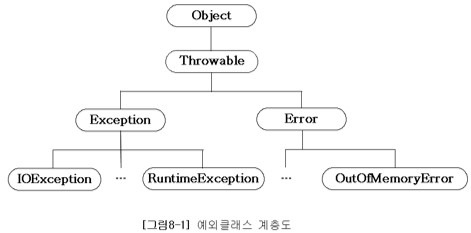
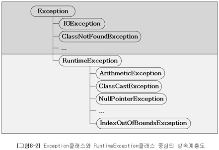
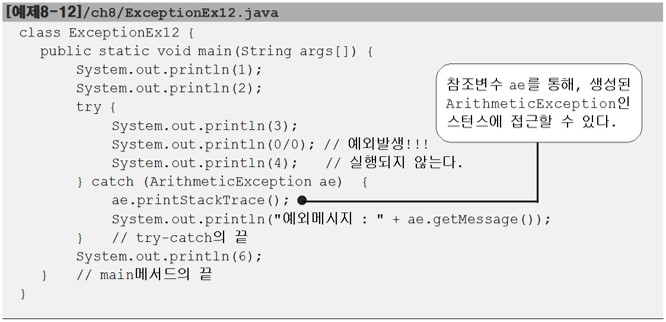
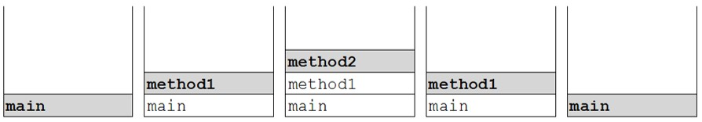

# Ch08. 예외처리
---
# 1. 예외처리(exception handling)

### 1.1 프로그램 오류
에러의 종류
* 컴파일 에러(compile-time error): 컴파일 할 때 발생하는 에러
  - java 컴파일러의 기능: 구문체크, 번역, 최적화, 생략된 코드 추가
* 런타임 에러(runtime error): 실행 할 때 발생하는 에러
  - 에러(error): 프로그램 코드에 의해서 수습될 수 없는 심각한 오류
  - 예외(exception): 프로그램 코드에 의해 수습될 수 있는 다소 미약한 오류
* 논리적 에러(logical error): 작성 의도와 다르게 동작

### 1.2 예외 클래스의 계층 구조





* Exception 클래스와 그 자손들 : 사용자의 실수와 같은 외적 요인에 의해 발생하는 예외
* RuntimeException 클래스와 그 자손들 : 프로그래머의 실수로 발생하는 예외

### 1.3 예외처리하기 - try-catch문

* 예외처리의 정의와 목적
  - 정의: 프로그램 실행시 발생할 수 있는 예외의 발생에 대비한 코드를 작성하는 것
  - 목적: 프로그램의 비정상 종료를 막고, 정상적인 실행상태를 유지하는 것

```java
try{
        // 예외가 발생할 가능성이 있는 문장들을 넣는다.
        }catch(Exception1 e1){
        // Exception1이 발생했을 경우, 이를 처리하기 위한 문장을 적는다.
        }catch(Exception2 e2){
        // Exception2가 발생했을 경우, 이를 처리하기 위한 문장을 적는다.
        }catch(Exception3 eN){
        // ExceptionN이 발생했을 경우, 이를 처리하기 위한 문장을 적는다.
        }
```

※ if문과 달리, try블럭이나 catch 블럭 내에 포함된 문장이 하나뿐이어도 괄호{}를 생략할 수 없다

### 1.4 try-catch문에서의 흐름

* try블럭 내에서 예외가 발생한 경우
    1. 발생한 예외와 일치하는 catch블럭이 있는지 확인한다
    2. 일치하는 catch블럭을 찾게되면, 그 catch블럭 내의 문장들을 수행하고 전체 try-catch문을 빠져나가서 그 다음 문장을 계속해서 수행한다 만일 일치하는 catch블럭을 찾지 못하면, 예외는
       처리되지 못한다.
* try블럭 내에서 예외가 발생하지 않은 경우
    1. catch블럭을 거치지 않고 전체 try-catch문을 빠져나가서 수행을 계속한다.

### 1.5 예외의 발생과 catch블럭

* 예외가 발생하면, 이를 처리할 catch블럭을 찾아 내려감
* 일치하는 catch블럭이 없으면, 예외는 처리 안됨
* Exception이 선언된 catch블럭은 모든 예외 처리(마지막 catch 블럭)
  - } catch (Exception e) { } -> Exception 타입의 참조변수가 아닌 Exception클래스의 참조변수 선언

### 1.6 printStackTrace()와 getMessage()

* printStackTrace(): 예외발생 당시의 호출스택(Call Stack)에 있었던 메서드의 정보와 예외 메시지를 화면에 출력한다.
* getMessage(): 발생한 예외 클래스의 인스턴스에 저장된 메시지를 얻을 수 있다.
  
  - 참조변수 ae의 유효범위(scope)는 catch블럭 내

### 1.7 멀티 catch블럭

* 내용이 같은 catch블럭을 하나로 합친 것(JDK1.7부터)

### 1.8 예외 발생시키기

* 연산자 new를 이용해서 발생시키려는 예외 클래스의 객체를 만든 다음
  - Exception e = new Exception("고의로 발생시켰음")
* 키워드 'throw'를 이용해서 예외를 발생시킨다.
  - throw e;

```java
class Ex8_6 {
    public static void main(String[] args) {
        try {
            Exception e = new Exception("고의로 발생시켰음");   //예외에 대한 정보가 있음
            throw e;
//          throw new Exception("고의로 발생시켰음");   위의 두줄을 한줄로 표현 가능
        } catch (Exception e) {              //캐치블럭 내에서 예외 정보를 쓸 수 있음
            e.printStackTrace();
            System.out.println("에러메시지 : " + e.getMessage());
        }
        System.out.println("프로그램이 정상 종료되었음");
    }
}
// 캐치 블럭이 예외를 처리
출력:
        java.lang.Exception:고의로 발생시켰음
        at Ex8_6.main(Ex8_6.java:4)
        에러메시지:고의로 발생시켰음
        프로그램이 정상 종료되었음
```

### 1.9 checked예외, unchecked예외

* checked 예외 : 컴파일러가 예외 처리 여부를 체크(예외 처리 필수)
  - Exception 들
* unchecked 예외 : 컴파일러가 예외 처리 여부를 체크 안함(예외 처리 선택)
  - RuntimeException 들

```java
class Ex8_7 {
    public static void main(String[] args) {
        try { // Exception과 그 자손은 compiler에서 에러 발생
            throw new Exception(); // Exception을 고의로 발생시킨다.
        } catch (Exception e) {
        }

        // RuntimeException과 그 자손은 예외처리를 해주지 않아도 컴파일 된다.
        throw new RuntimeException();
    }
}
```

### 1.10 메서드에 예외 선언하기

* 예외를 처리하는 방법
  - try-catch문: 직접처리 or 은폐(빈catch 블럭)
  - 예외 선언하기: 예외떠넘기기(알리기)
* 메서드가 호출시 발생가능한 예외를 호출하는 쪽에 알리는 것

※ 예외를 발생시키는 'throw'와 예외를 메서드에 선언할 때 쓰는 'throws' 구분 필요

```java
    void method()throws Exception1,Exception2,...ExceptionN{ // 메서드에 예외 선언
        // 메서드의 내용
        }

// method()에서 Exception과 그 자손 예외 발생 가능
        void method()throws Exception{
        // 메서드의 내용
        }
```

```java
class Ex8_9 {
    public static void main(String[] args) throws Exception {
        method1();
    }

    static void method1() throws Exception {
        method2();
    }

    static void method2() throws Exception {
        throw new Exception();
    }
}
// 예외 떠넘기기의 예시
출력:
        Exception in thread"main"java.lang.Exception
        at Ex8_9.method2(Ex8_9.java:12)
        at Ex8_9.method1(Ex8_9.java:8)
        at Ex8_9.main(Ex8_9.java:4)
```



* 예제(Ex8_9) 결과를 통해 다음과 같은 사실을 알 수 있음 :
  - 예외가 발생했을 때, 모두 3개의 메서드가 호출 스택에 있었으며,
  - 예외가 발생한 곳은 제일 윗줄에 있는 method2() 라는 것과
  - main() -> method1 -> method2 순으로 호출 했다는 것

```java
//try-catch문을 통하여 예외를 main메서드에서 처리할지, 해당 메서드에서 처리할지를 결정해야함

import java.io.*;

class Ex8_10 {
    public static void main(String[] args) {
        try {
            File f = createFile(args[0]);
            System.out.println(f.getName() + "파일이 성공적으로 생성되었습니다.");
        } catch (Exception e) {
            System.out.println(e.getMessage() + " 다시 입력해 주시기 바랍니다.");
        }
    }    // main메서드의 끝

    static File createFile(String fileName) throws Exception {
        if (fileName == null || fileName.equals(""))
            throw new Exception("파일이름이 유효하지 않습니다.");
        File f = new File(fileName);        //  File클래스의 객체를 만든다.
        // File객체의 createNewFile메서드를 이용해서 실제 파일을 생성한다.
        f.createNewFile();
        return f;        // 생성된 객체의 참조를 반환한다.
    }    // createFile메서드의 끝
}    // 클래스의 끝
```

### 1.11 finally 블럭

* 예외 발생 여부와 관계없이 수행되어야 하는 코드를 넣는다.

```java
try{
        // 예외 발생 가능성 있는 문장들을 넣는다.
        }catch(Exception1 e1){
        // 예외 처리를 위한 문장을 넣는다.
        }finally{
        // 예외의 발생여부에 관계없이 항상 수행되어야하는 문장들을 넣는다.
        // finally블럭은 try-catch문의 맨 마지막에 위치해야한다.
        }
```

※ try블럭 안에 return문이 있어서 try블럭을 벗어나갈 때도 finally블럭은 실행된다.

### 1.12 사용자 정의 예외 만들기

* 우리가 직접 예외 클래스를 정의할 수 있다. (상속을 이용하여)
* 조상은 Exception과 RuntimeException 중에서 선택
  - 가능하면 선택처리가 가능한 RuntimeException을 사용하고 꼭 필요한 경우 Exception 사용할 것
* 문자열을 매개변수로 받는 생성자를 생성하여 에러메시지를 받을 수 있게 한다.

```java
class MyException extends Exception {
    MyException(String msg) { // 문자열을 매개변수로 받는 생성자
        super(msg); // 조상인 Exception클래스의 생성자를 호출한다.
    }
}
```

※ super() : 조상 클래스의 생성자 'Exception(String msg)'를 호출

### 1.13 예외되던지기(exception re-throwing)

* 예외를 처리한 후에 다시 예외를 발생시키는 것
* 호출한 메서드와 호출된 메서드 양쪽 모두에서 예외처리하는 것

```java
class Ex8_12 {
    public static void main(String[] args) {
        try {
            method1();
        } catch (Exception e) {
            System.out.println("main메서드에서 예외가 처리되었습니다.");
        }
    }       // main 메서드의 끝

    static void method1() throws Exception {
        try {
            throw new Exception();
        } catch (Exception e) {
            System.out.println("method1메서드에서 예외가 처리되었습니다.");
            throw e;            // 다시 예외를 발생시킨다.
        }
    }       // method1 메서드의 끝
}

출력:
        method1메서드에서 예외가 처리되었습니다.
        main메서드에서 예외가 처리되었습니다.
```

### 1.14 연결된 예외(chained exception)

* 한 예외가 다른 예외를 발생시킬 수 있다.
* 예외 A가 예외 B를 발생시키면, A는 B의 원인 예외(cause exception)가 된다.
  - Throwable initCause(Throwable cause) : 지정한 예외를 원인 예외로 등록
  - Throwable getCause() : 원인 예외를 반환

```java
public class Throwable implement Serializable {
	...
    private Throwable cause = this; // 객체 자신(this)을 원인 예외로 등록
	...

    // 자신 안에 다른 예외를 포함 시킴
    public synchronized Throwable initCause(Throwable cause) {
        this.cause = cause; // cause를 원인 예외로 등록
        return this;
    }
	...
}
```

* 연결된 예외 사용 이유
  - 여러 예외를 하나로 묶어서 다루기 위해
  - checked 예외를 unchecked 예외로 변경하려 할 때 사용
