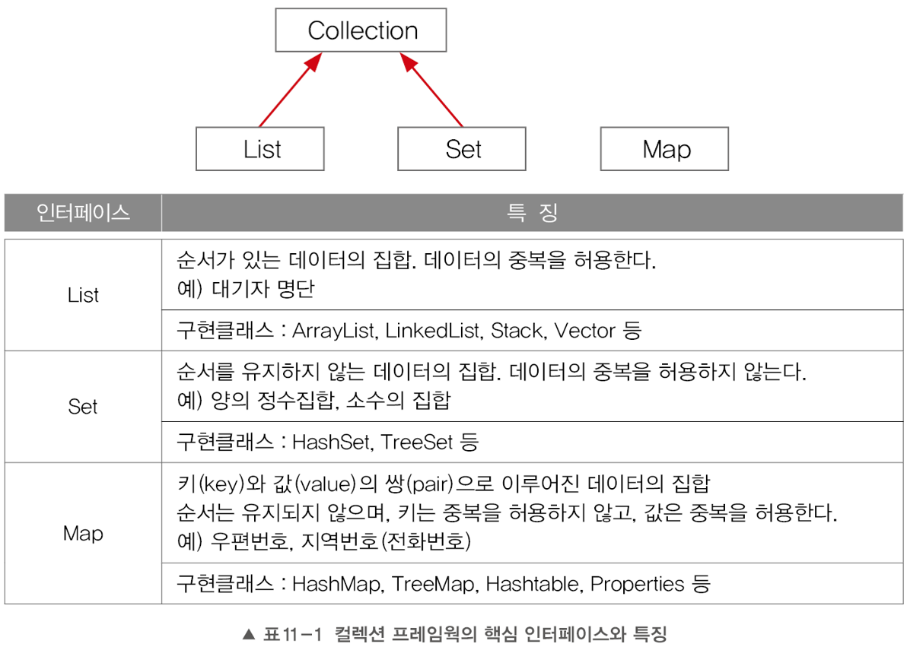

# Ch11. 컬렉션 프레임웍
---

## 1.컬렉션 프레임웍(Collections Framework)

* 컬렉션(collection)
  - 여러 객체(데이터)를 모아 놓은 것을 의미
* 프레임웍(framework)
  - 표준화, 정형화된 체계적인 프로그래밍 방식
  - 라이브러리 + 프로그래밍 하는 방식까지 정해둠
  - 생산성 증가 (spring)
* 컬렉션 프레임웍(collection framework)
  - 컬렉션(다수의 객체)을 다루기 위한 표준화된 프로그래밍 방식
  - 컬렉션을 쉽고 편리하게 다룰 수 있는 다양한 클래스를 제공
  - java.util패키지에 포함. JDK1.2부터(표준화) 제공
* 컬렉션 클래스(collection class)
  - 다수의 데이터를 저장할 수 있는 클래스(예, vector, ArrayList, HashSet)
### 1.1 컬렉션 프레임웍의 핵심 인터페이스
* 컬렉션 프레임웍에서는 컬렉션데이터 그룹을 3개의 인터페이스로 다룬다.

* List Interface(목록): 순서 있음, 중복 허용
* Set Interface(집합): 순서 없음, 중복 불가
* Map Interface: 순서 없음, 키(ID)는 중복 불가, 값(PW)은 중복 허용
### 1.2 ArrayList

### 1.3 LinkedList

### 1.4 Stack과 Queue

### 1.5 Iterator, Listiterator, Enumeration

### 1.6 Arrays

### 1.7 Comparator와 Comparable

### 1.8 HashSet

### 1.9 TreeSet

### 1.10 HashMap과 Hashtable

### 1.11 TreeMap

### 1.12 Properties

### 1.13 Collections

### 1.14 컬렌션 클래스 정리 & 요약