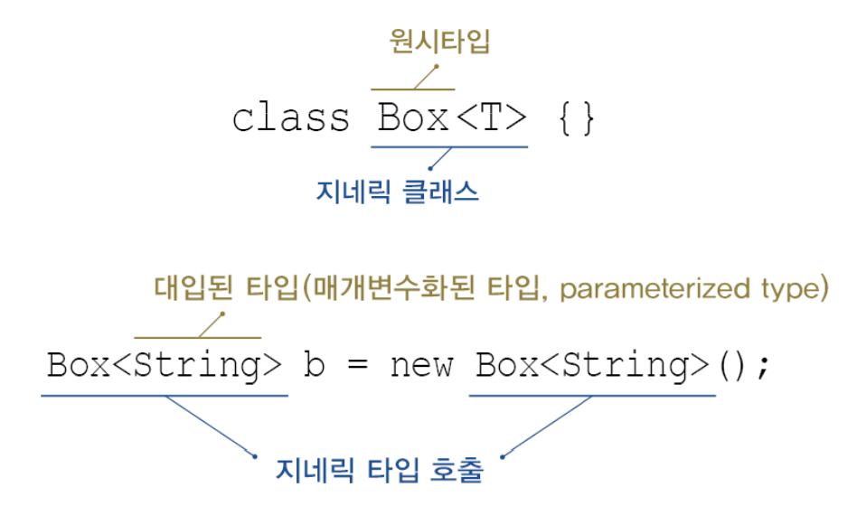

# Ch12. 지네릭스, 열거형, 애너테이션

-----

## 1. 지네릭스
### 1.1 지네릭스란?
* 컴파일 시 타입을 체크해 주는 기능(compile-time type check)(JDK1.5)
* 객체의 타입 안정성을 높이고 형변환의 번거로움을 줄여줌
```java
// Tv객체만 저장할 수 있는 ArrayList를 생성
ArrayList<Tv> tvList = new ArrayList<Tv>();

tvList.add(new Tv()); // OK
tvList.add(new Audio()); // 컴파일 에러. Tv 외 다른 타입 저장 불가
```
* 지네릭스의 장점
  - 타입 안정성을 제공한다. (classCastException을 줄일 수 있다)
  - 타입체크와 형변환을 생략할 수 있으므로 코드가 간결해 진다.
  - 런타임에러를 컴파일시의 에러로 만들어서 수정가능하게 만든다.
### 1.2 지네릭 클래스의 선언
#### 타입변수
* 클래스를 작성할 때, Object타입 대신 타입 변수(E)를 선언해서 사용.
* 객체를 생성 시, 타입 변수(T) 대신 실제 타입을 지정(대입)
* 타입 변수 대신 실제 타입이 지정되면, 형변환 생략 가능
```java
// 지네릭스 미사용
ArrayList tvList = new ArrayList();
tvList.add(new Tv());
Tv t = (Tv)tvList.get(0);   //형변환 필수
```
```java
// 지네릭스(타입변수) 사용
ArrayList<Tv> tvList = new ArrayList<Tv>();
tvList.add(new Tv());
Tv t = tvList.get(0); // 형변환 불필요
```
#### 지네릭스 용어
* Box : 지네릭 클래스. T의 Box 또는 T Box라고 읽는다.
* T : 타입 변수 또는 타입 매개변수.(T는 타입 문자)
* Box : 원시 타입(raw type) // 일반 클래

 
T 대신 String을 대입한 것과 같음 

#### 지네릭 타입과 다형성
* 참조 변수와 생성자의 대입된 타입은 일치해야 한다.
```java
ArrayList<Tv> list = new ArrayList<Tv>();      // OK. 일치
ArrayList<Product> list = new ArrayList<Tv>(); // 에러. 불일치
```
* 지네릭 클래스 간의 다형성은 성릭.(여전히 대입된 타입은 일치해야)
```java
List<Tv> list = new ArrayList<Tv>();    // ArrayList가 List 구현
List<Tv> list = new LinkedList<Tv>();   // LinkedList가 List 구현
```
* 매개변수의 다형성도 성립.
```java
ArrayList<Product> list = newArrayList<Product>();
list.add(new Product());
list.add(new Tv());         // Product의 자손도 OK
list.add(new Audio());      // Product의 자손도 OK
```
* 대신, ArrayList에 저장된 객체를 꺼낼 때, 형변환 필요
```java
Product p = list.get(0); // Product 객체는 형변환이 필요없다.
Tv t = (Tv)list.get(1); // Product의 자손객체들은 형변환을 필요로 한다.
```

```java
import java.util.ArrayList;
import java.util.List;

public class Ex12_1 {
	public static void main(String[] args) {
		ArrayList<Product> productList = new ArrayList<Product>();
		ArrayList<Tv> tvList = new ArrayList<Tv>();
		ArrayList<Product> tvList2 = new ArrayList<Tv>(); // 에러.
		List<Tv> tvList3 = new ArrayList<Tv>(); // OK. 다형성
		
		productList.add(new Tv());
		productList.add(new Audio());
		
		tvList.add(new Tv());
		
		printAll(productList);
		printAll(tvList); // 컴파일 에러 발생
	}
	
	public static void printAll(ArrayList<Product> list){
		for(Product p : list) {
			System.out.println(p);
		}
	}
}

class Product {}
class Tv extends Product {}
class Audio extends Product {}
```

