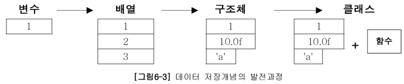
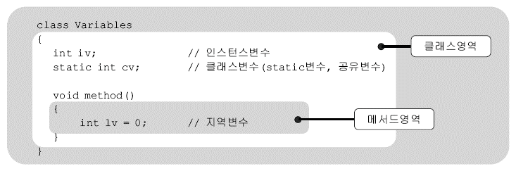

# Ch06. 객체지향 프로그래밍 I

## 1. 객체지향언어
### 1.1 개요 
* OOP(Object Oreinted Programming)
* 객체지향언어 = 프로그래밍 언어 + 객체지향개념(규칙)
* 핵심 개념
   * 캡슐화
   * 상속
   * 추상화
   * 다형성☆
----------------------------
## 2. 클래스와 객체
### 2.1 개요
* 클래스
   - 정의 : 객체를 정의해 놓은 것 (Ex. 설계도)
   - 용도 : 객체를 생성하는데 사용
* 객체
   - 정의 : 실제로 존재하는 것 (Ex. 제품)
      - 유형 : 사물 (Ex.책상, 의자, 자동차)
      - 무형 : 논리, 개념 (Ex. 수학공식, 프로그램 에러)
   -  용도 : 객체가 가지고 있는 기능과 속성에 따라 다름
### 2.2 객체와 인스턴스 
* 객체 : 모든 인스턴스를 대표하는 일반적 용어
* 인스턴스 : 특정 클래스로부터 생성된 객체
#### 2.1~2.2 정리
* Q1. 클래스가 필요한 이유
  - A . 객체를 생성하기 위해
* Q2. 객체가 필요한 이유
  - A . 객체를 사용하기 위해
* Q3. 객체를 사용한다는 것?
  - A . 객체가 가진 속성(변수)과 기능(메서드)을 사용하기 위해

### 2.3 객체의 구성요소
* 멤버 : (멤버)변수 + 메서드
  - 속성 : (멤버)변수
  - 기능 : 메서드

### 2.4 인스턴스의 생성과 사용
   * 순서
     1.  클래스 작성
     2.  객체 생성
     3.  객체 사용
```java
      // 1. 클래스 작성
         class Tv {
            String color;                   // 변수(색깔)
            boolean power;                  // 변수(전원상태)
            int channel;                    // 변수(채널)

            void power() {power = !power;}   // 메서드(전원)
            void channerlUp() {channer++;}   // 메서드(채널+)
            void channelDown() {channel--;}  // 메서드(채널-)
         }
      // 2. 객체의 생성
      클래스명 변수명;                    // ex) Tv t;
      변수명 = new 클래스명();            // ex) t = new Tv();
      
      합쳐서

      클래스명 변수명 = new 클래스명();    // ex) Tv t = new Tv();

      // 3. 객체의 사용
      t.channel = 7;                     // (멤버)변수 사용
      t.channelDown();                   // 메서드 사용
   ```
      
### 2.5 객체 배열
   * 객체 배열 == 참조변수 배열
   * 객체 배열 생성 시 각 요소는 null로 자동 초기화
   * ☆ 객체 배열 생성 != 객체 생성 ☆
   * 객체를 생성해서 객체 배열의 각 요소에 저장
     - 다뤄야할 객체의 수가 많을 때는 for 문을 사용 
### 2.6 클래스의 정의
   * 클래스의 정의
      - 설계도 -> 위에서 다룸
      - **데이터 + 함수**
      - **사용자 정의 타입**
   * 클래스 == 데이터 + 함수  
   
      |구조명|정의|
      |:---|:---|
      |변수|하나의 데이터를 저장할 수 있는 공간|
      |배열| **같은 종류**의 여러 데이터를 하나의 집합으로 저장할 수 있는 공간|
      |구조체|서로 관련된 여러 데이터를 (**종류에 관계없이**) 하나의 집합으로 저장할 수 있는 공간|
      |클래스|데이터와 함수|
   * 사용자 정의 타입
      - 원하는 타입을 만들 수 있음
      - 서로 관련된 값을 묶어서 하나의 타입으로 정의 할 수 있음

         ```java
            class Time {
               int hour;
               int minute;
               int second;
            }                           //사용자 정의 타입 Time 클래스를 만들 경우
         ``` 

         ```java
            int hour;
            int minute;
            int second;                  // 의 경우엔
               
            Time t = new Time();          //으로 표현 가능
         ```
         ```java
            int hour1,hour2,hour3;
            int minute1,minute2,minute3;
            int second1,second2,second3; // 의 경우엔

            Time t1 = new Time();
            Time t2 = new Time();
            Time t3 = new Time();         // 와 같이 표현 가능
         ```
         ```java
            int[] hour = new int[3];
            int[] minute = new int[3];
            int[] second = new int[3];  // 의 경우엔 

            Time t = new Time[3];
            t[0] = new Time();
            t[1] = new Time();
            t[2] = new Time();           //와 같이 표현 가능
         ```
     - ※비교※
         - 참조변수(t) 의 차이는 있지만 저장공간은 같음
         - Time 클래스 생성이 더 객체지향적(hour, minute, second가 하나로 더 강하게 묶여있음)
----------------------------
## 3. 변수와 메서드
### 3.1 선언위치에 따른 변수의 종류
   
  * 클래스영역,메서드영역 모두 선언문만 가능, 순서 상관 없음
     - 인스턴스변수 : 객체 생성 필요
     - 클래스변수 : 아무때나 사용가능, 객체 생성 필요 없음(자동 생성)
     - 지역변수: 종료시 소멸

|변수의 종류|선언위치|생성시기|비고|
|:---|:---:|:---|:---:|
|인스턴스변수(iv)|클래스영역| ☆인스턴스 생성시☆|객체 == ∑iv
|클래스변수(cv) | 클래스영역| 클래스가 메모리에 올라왔을 때| static + iv|
|지역변수(lv) | 매서드 영역| 변수 선언문 수행시|

### 3.2 클래스변수와 인스턴스 변수
   * 
