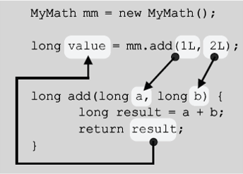

# Ch06. 객체지향 프로그래밍 I

## 1. 객체지향언어
### 1.1 개요 
* OOP(Object Oreinted Programming)
* 객체지향언어 = 프로그래밍 언어 + 객체지향개념(규칙)
* 핵심 개념
   * 캡슐화
   * 상속
   * 추상화
   * 다형성☆
----------------------------
## 2. 클래스와 객체
### 2.1 개요
* 클래스
   - 정의 : 객체를 정의해 놓은 것 (Ex. 설계도)
   - 용도 : 객체를 생성하는데 사용
* 객체
   - 정의 : 실제로 존재하는 것 (Ex. 제품)
      - 유형 : 사물 (Ex.책상, 의자, 자동차)
      - 무형 : 논리, 개념 (Ex. 수학공식, 프로그램 에러)
   -  용도 : 객체가 가지고 있는 기능과 속성에 따라 다름
### 2.2 객체와 인스턴스 
* 객체 : 모든 인스턴스를 대표하는 일반적 용어
* 인스턴스 : 특정 클래스로부터 생성된 객체
#### 2.1~2.2 정리
* Q1. 클래스가 필요한 이유
  - A . 객체를 생성하기 위해
* Q2. 객체가 필요한 이유
  - A . 객체를 사용하기 위해
* Q3. 객체를 사용한다는 것?
  - A . 객체가 가진 속성(변수)과 기능(메서드)을 사용하기 위해

### 2.3 객체의 구성요소
* 멤버 : (멤버)변수 + 메서드
  - 속성 : (멤버)변수
  - 기능 : 메서드

### 2.4 인스턴스의 생성과 사용
   * 순서
     1.  클래스 작성
     2.  객체 생성
     3.  객체 사용
```java
      // 1. 클래스 작성
         class Tv {
            String color;                   // 변수(색깔)
            boolean power;                  // 변수(전원상태)
            int channel;                    // 변수(채널)

            void power() {power = !power;}   // 메서드(전원)
            void channerlUp() {channer++;}   // 메서드(채널+)
            void channelDown() {channel--;}  // 메서드(채널-)
         }
      // 2. 객체의 생성
      클래스명 변수명;                    // ex) Tv t;
      변수명 = new 클래스명();            // ex) t = new Tv();
      
      합쳐서

      클래스명 변수명 = new 클래스명();    // ex) Tv t = new Tv();

      // 3. 객체의 사용
      t.channel = 7;                     // (멤버)변수 사용
      t.channelDown();                   // 메서드 사용
   ```
      
### 2.5 객체 배열
   * 객체 배열 == 참조변수 배열
   * 객체 배열 생성 시 각 요소는 null로 자동 초기화
   * ☆ 객체 배열 생성 != 객체 생성 ☆
   * 객체를 생성해서 객체 배열의 각 요소에 저장
     - 다뤄야할 객체의 수가 많을 때는 for 문을 사용 
### 2.6 클래스의 정의
   * 클래스의 정의
      - 설계도 -> 위에서 다룸
      - **데이터 + 함수**
      - **사용자 정의 타입**
   * 클래스 == 데이터 + 함수  
   
      |구조명|정의|
      |:---|:---|
      |변수|하나의 데이터를 저장할 수 있는 공간|
      |배열| **같은 종류**의 여러 데이터를 하나의 집합으로 저장할 수 있는 공간|
      |구조체|서로 관련된 여러 데이터를 (**종류에 관계없이**) 하나의 집합으로 저장할 수 있는 공간|
      |클래스|데이터와 함수|
   * 사용자 정의 타입
      - 원하는 타입을 만들 수 있음
      - 서로 관련된 값을 묶어서 하나의 타입으로 정의 할 수 있음

         ```java
            class Time {
               int hour;
               int minute;
               int second;
            }                           //사용자 정의 타입 Time 클래스를 만들 경우
         ``` 

         ```java
            int hour;
            int minute;
            int second;                  // 의 경우엔
               
            Time t = new Time();          //으로 표현 가능
         ```
         ```java
            int hour1,hour2,hour3;
            int minute1,minute2,minute3;
            int second1,second2,second3; // 의 경우엔

            Time t1 = new Time();
            Time t2 = new Time();
            Time t3 = new Time();         // 와 같이 표현 가능
         ```
         ```java
            int[] hour = new int[3];
            int[] minute = new int[3];
            int[] second = new int[3];  // 의 경우엔 

            Time t = new Time[3];
            t[0] = new Time();
            t[1] = new Time();
            t[2] = new Time();           //와 같이 표현 가능
         ```
     - ※비교※
         - 참조변수(t) 의 차이는 있지만 저장공간은 같음
         - Time 클래스 생성이 더 객체지향적(hour, minute, second가 하나로 더 강하게 묶여있음)
----------------------------
## 3. 변수와 메서드
### 3.1 선언위치에 따른 변수의 종류
   
  * 클래스영역,메서드영역 모두 선언문만 가능, 순서 상관 없음
     - 인스턴스변수 : 객체 생성 필요
     - 클래스변수 : 아무때나 사용가능, 객체 생성 필요 없음(자동 생성)
     - 지역변수: 종료시 소멸

|변수의 종류|선언위치|생성시기|비고|
|:---|:---:|:---|:---:|
|인스턴스변수(iv)|클래스영역| ☆인스턴스 생성시☆|객체 == ∑iv|
|클래스변수(cv) | 클래스영역| 클래스가 메모리에 올라왔을 때| static + iv|
|지역변수(lv) | 매서드 영역| 변수 선언문 수행시|-

### 3.2 클래스변수와 인스턴스 변수
   * 클래스변수
     - 공통 속성 표현, 같은 저장공간을 참조 == 같은 값을 갖음 
     - 사용시 클래스이름.클래스변수 (Ex. Card.width)
      * 인스턴스변수
     - 개별 속성 표현
     - 사용시 참조변수.인스턴스변수 (Ex. c.number)
### 3.3 메서드
   * 특정 작업을 수행하는 일련의 문장들의 묶음 (작업단위)
   * 값(입력)을 받아서 처리하고, 결과를 반환(출력)
     - 함수(클래스에 독립적)과 유사하지만 메서드는 클래스 내에 있어야함
   * 메서드의 장점
     - 코드의 중복을 줄일 수 있다
     - 코드의 관리가 쉽다
     - 코드를 재사용할 수 있다
     - 코드가 간결해서 이해하기 쉬워진다
   * 메서드의 작성
     - 반복적으로 수행되는 여러 문장을 메서드로 작성(최소의미 단위)
     - 하나의 메서드는 한 가지 기능만 수행하도록 작성
### 3.4 메서드의 선언과 구현
   * 메서드 = 선언부 + 구현부
     - 선언부 : 반환타입(출력) 메서드이름 매개변수선언(입력) 
               (Ex. int add (int x, int y))
     - 구현부 : 메서드를 호출했을 때 수행될 문장
       -  반환타입이 void 가 아닌 경우 return 반환값; 을 반드시 포함
       -  지역변수(lv) : 메서드 내에 선언된 변수
### 3.5 메서드의 호출
   * 메서드를 호출하는 방법
   ```java
      print99danAll();        // 입력값이 없는 경우, 반환 타입이
      int result = add(3, 5); // 입력값이 있는 경우, 결과를 result에 저장
   ```
   * 예제 문제 강의에서 삼항 조건 연산자 연습이 있으므로 [삼항연산자연습](https://youtu.be/6_GxMvWbkXw?list=PLW2UjW795-f5JPTsYHGAawAck9cQRw5TD&t=890)참고
   * 메서드의 호출되었을 때 실행 흐름

      
     
     0. MyMath클래스(메서드) 작성   //그림에는 생략
     1. MyMath객체 생성
     2. MyMath객체 사용
### 3.6 return문
  * 실행 중인 메서드를 종료하고 호출한 곳으로 되돌아감
  * 반환 타입이 void인 경우 생략 가능 (컴파일러가 자동으로 추가)
  * 조건문을 사용할 때 return문 실행 여부를 확인☆
  * 반환값(return value)
    - 반환타입이 void가 아닐 때 : 타입이 일치(또는 자동형변환 가능해야함)
### 3.7 호출스택(call stack) // 내용 추가 필요
  * 스택(stack) : 밑이 막힌 상자. 위에 차곡차곡 쌓임
  * 호출스택의 특징
    - 메서드 수행에 필요한 메모리가 제공되는 공간
    - 메서드가 호출되면 호출스택에 메모리 할당, 종료되면 해제
    - 아래있는 메서드가 위의 메서드를 호출
    - 맨 위의 메서드 하나만 실행 중, 나머지는 대기중 
### 3.8 기본형 매개변수와 참조형 매개변수 ☆
  * 기본형 매개변수 : 변수의 **값**을 읽기만 할 수 있다(read only)
    - bloolean, char, byte, short, int, long, float, double(8개)
  * 참조형 매개변수 : 변수의 **값**을 읽고 **변경**할 수 있다(read & write)
    - 기본형 매개변수와 달리 객체의 값이 아니라 주소를 메서드에 넘김
### 3.9 참조형 반환타입
  * 메서드가 객체의 주소를 반환
### 3.10 재귀호출
  * 반복문보다 비효율적이지만 논리적으로 간결
### 3.11 클래스 메서드(static 메서드)와 인스턴스 메서드
  * 인스턴스 메서드
    - 인스턴스 생성 후, '참조변수.메서드이름()'으로 호출
    - 인스턴스 멤버(iv,im(instance method))와 관련된 작업을 하는 메서드
    - 메서드 내에서 인스턴스 변수(iv) 사용 가능
  * static 메서드(클래스 메서드)
    - 객체 생성 없이 '클래스이름.메서드이름()'으로 호출
    - 인스턴스 멤버(iv, im(instance method))와 관련없는 작업을 하는 메서드
    - 메서드 내에서 인스턴스 변수(iv) 사용 불가
  * static을 언제 붙여야 할까?
    - 속성(멤버 변수)중에서 공통 속성에 static을 붙인다
    - 인스턴스 멤버(iv,im)을 사용하지 않는 메서드에 static을 붙인다
  * 메서드 간의 호출과 참조
    - 같은 클래스에 속한 멤버들 간에는 별도의 인스턴스를 생성하지 않고도 서로 참조 가능
    - 단, 클래스멤버가 인스턴스 멤버를 참조 또는 호출하고자 하는 경우에는 인스턴스를 생성 해야함
    - 인스턴스 멤버가 존재하는 시점에 클래스 멤버는 항상 존재
    - 클래스 멤버가 존재하는 시점에 인스턴스 멤버가 존재하지 않을 수 있음
      ```java
      class TestClass {
         void instanceMethod() {}      // 인스턴스메서드
         static void staticMathod() {} // static메서드

         void instanceMethod2() {      // 인스턴스메서드 
            instanceMethod();          // 다른 인스턴스메서드 호출
            staticMethod();            // static메서드를 호출
         }

         static void staticMethod2() { // static 메서드
            instanceMethod();          // 에러!! 인스턴스메서드 호출 불가
            staticMethod();            // static 메서드는 호출 가능
         }
      }
      ```

      ```java
      class TestClass2 {
         int iv;                       // 인스턴스 변수
         static int cv;                // 클래스 변수

         void instanceMethod() {       // 인스턴스 메서드
            System.out.println(iv);    // 인스턴스 변수 사용 가능
            System.out.println(cv);    // 클래스변수 사용 가능
         }

         static void staticMethod() {  // 클래스 메서드
            System.out.println(iv);    // 에러!! 인스턴스 변수 사용 불가
            System.out.println(cv);    // 클래스 변수는 사용 가능
         }
      }
      ```
     - static메서드는 static메서드 호출 가능
     - static메서드는 인스턴스변수 사용 불가
     - static메서드는 인스턴스메서드 호출 불가
     - static메서드 호출시 객체(인스턴스변수)가 없을수 있음