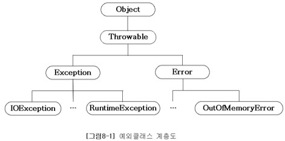
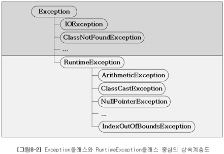

# Ch08. 예외처리
-----------------

# 1. 예외처리(exception handling)

### 1.1 프로그램 오류

* 컴파일 에러(compile-time error): 컴파일 할 때 발생하는 에러
    - java 컴파일러의 기능: 구문체크, 번역, 최적화, 생략된 코드 추가
* 런타임 에러(runtime error): 실행 할 때 발생하는 에러
    - 에러(error): 프로그램 코드에 의해서 수습될 수 없는 심각한 오류
    - 예외(exception): 프로그램 코드에 의해 수습될 수 있는 다소 미약한 오류
* 논리적 에러(logical error): 작성 의도와 다르게 동작

### 1.2 예외 클래스의 계층 구조





* Exception 클래스와 그 자손들 : 사용자의 실수와 같은 외적 요인에 의해 발생하는 예외
* RuntimeException 클래스와 그 자손들 : 프로그래머의 실수로 발생하는 예외

### 1.3 예외처리하기 - try-catch문

* 예외처리의 정의와 목적
    - 정의: 프로그램 실행시 발생할 수 있는 예외의 발생에 대비한 코드를 작성하는 것
    - 목적: 프로그램의 비정상 종료를 막고, 정상적인 실행상태를 유지하는 것

```java
try {
	// 예외가 발생할 가능성이 있는 문장들을 넣는다.
} catch (Exception1 e1) {
	// Exception1이 발생했을 경우, 이를 처리하기 위한 문장을 적는다.
} catch (Exception2 e2) {
	// Exception2가 발생했을 경우, 이를 처리하기 위한 문장을 적는다.
} catch (Exception3 eN) {
	// ExceptionN이 발생했을 경우, 이를 처리하기 위한 문장을 적는다.
}
```
※ if문과 달리, try블럭이나 catch 블럭 내에 포함된 문장이 하나뿐이어도 괄호{}를 생략할 수 없다

### 1.4 try-catch문에서의 흐름
* try블럭 내에서 예외가 발생한 경우
  1. 발생한 예외와 일치하는 catch블럭이 있는지 확인한다
  2. 일치하는 catch블럭을 찾게되면, 그 catch블럭 내의 문장들을 수행하고 
     전체 try-catch문을 빠져나가서 그 다음 문장을 계속해서 수행한다
     만일 일치하는 catch블럭을 찾지 못하면, 예외는 처리되지 못한다.
* try블럭 내에서 예외가 발생하지 않은 경우
  1. catch블럭을 거치지 않고 전체 try-catch문을 빠져나가서 수행을 계속한다.

### 1.5 예외의 발생과 catch블럭
* 예외가 발생하면, 이를 처리할 catch블럭을 찾아 내려감
* 일치하는 catch블럭이 없으면, 예외는 처리 안됨
* Exception이 선언된 catch블럭은 모든 예외 처리(마지막 catch 블럭)